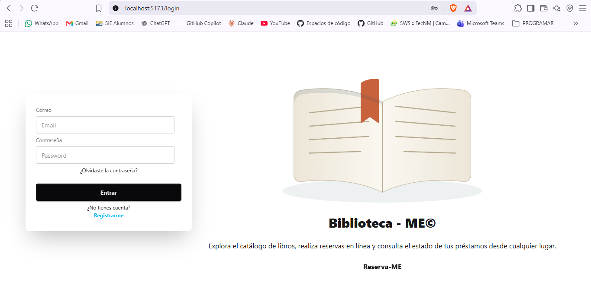
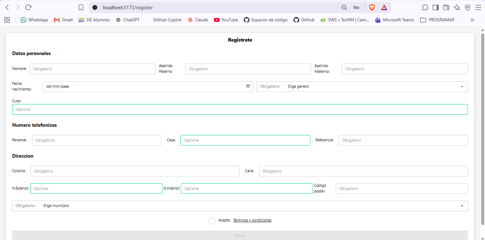

# App web reserva de libros 📖


<h2 align="center">Biblioteca ME</h2>

Applicación web contruido con enfoque de reservas de libros, que ayuda a los usuarios poder controlar y pedir libros fisicos de una biblioteca. Construido con tecnologias: `react.js`, `tailwind css`, libreria de ui como `daisyUI`, para la parte del backend construimos una api rest con el lenguaje `java` usando framework `spring-boot` herramientas como `spring-security`, autenticacion basada en token `JWT`.

# Paginas visuales de la app 👀

## Login



## Registro de usuarios



## Inicio y detalle de libros

> Nota: Por ahora cada libro no muestra su portada ya que la app desktop para administrador no se a hecho. Asi que por defecto usa la api de avatar mientras le agregamos sus respectivas imagenes.

## Demonostración pedir una reserva 🆕


## Paginas de actividades
Aqui se mostrara las actividades (reservas, prestamos y multas). Esta pagina es importante ya que aqui podras controlar cada apartado.


### Demostracion poder cancelar una reserva ❌


> Nota: Por el mismo problema anterior no se muestra la portada.

## Busqueda de libros 🔍
Aqui podras buscar libros por el nombre del libro, el orden de busqueda son por orden alfabetico `a-z`, por cada letra buscara y mostrara, de igual manera podras tener paginación.


## Paginas de dudas y preguntas ⁉️
Aqui encontraras todo sobre la web en caso de tener alguna duda.


## Actulización de perfil 👤


## Endpoints de la api rest 📡
### Autenticación 🗝️
| Método | Ruta | Descripción |
|--------|------|-------------|
| POST | `api/auth/login` | Inicia sesión y devuelve access token. |
| POST | `api/auth/register` | Registro de un nuevo usuario. |
| POST | `api/auth/refresh` | Renueva el access token usando la cookie httpOnly. |
| POST | `api/auth/logout` | Cierra sesión. |       |

### Libros 📚
| Método | Ruta | Descripción |
|--------|------|-------------|
| GET | `api/libros/public` | Obtienes todos los libros. Funciona por filtros. |
| GET | `api/libros/public/{id}` | Obtienes mas detalle de un libro por el id del libro.  |

### Perfil 👤
| Método | Ruta | Descripción |
|--------|------|-------------|
| GET | `api/perfil` | Obtienes el perfil autenticado. |
| PATCH | `api/perfil` | Actualizas tu información.  |
| PATCH | `api/perfil/foto` | Actualizas la foto de perfil. |

### Prestamos 
| Método | Ruta | Descripción |
|--------|------|-------------|
| GET | `api/prestamos/usuario` | Obtienes todos los prestamos de un usuario. Funciona por filtros. |

### Reservas
| Método | Ruta | Descripción |
|--------|------|-------------|
| GET | `api/reservas/usuario` | Obtienes todos las reservas de un usuario. Funciona por filtros. |
| POST | `api/reservas/usuario` | Creas y/o pides una nueva reserva. |
| PATCH | `api/reservas/usuario/{id}` | Cancelas una reservas. |

### Multas ✖️💸
| Método | Ruta | Descripción |
|--------|------|-------------|
| GET | `api/multas/usuario` | Obtienes todas las multas de usuario. Funciona por filtro. |

## Ultimas actulizaciones futuras ✍️
- [ ] Agregación de portada de cada libro.
- [ ] Skeleton para detalle de libro.
- [ ] Funcionamiento de favoritos.
- [ ] Más filtro de busqueda de libros.
- [ ] Hacer funcionar el boton de `Olvide contraseña`.

## Guia de instalación 💻

1. Tener node.js v22 o superior y npm (viene incluido).
2. Clonar repositorio
```bash
git clone https://github.com/AlfreGood20/web-reserva-biblioteca.git
```
3. Abrir la carpeta donde se clono el repositorio, puedes usar este comando si usas `vs code`.
```powershell
code .
```
4. Descargar dependencias de proyecto.
```powershell
npm install
```
5. Configurar .env en el archivo `api.js` (por defecto tiene la url de la api localhost).
```js
VITE_API_URL = http://localhost:8080/api
```
6. Correr el proyecto.
```powershell
npm run dev
```
Para comprobar si funciono en tu terminal debera de aparecer asi:
```powershell
> front_reservas_biblioteca@0.0.0 dev
> vite


  VITE v7.3.6  ready in 13647 ms

  ➜  Local:   http://localhost:5173/
  ➜  Network: use --host to expose
  ➜  press h + enter to show help
```

7. Build para producción (opcional)
```powerShell
npm run build
```
> Nota: Deberas tener corriendo la api rest, esto podria ocasionar errores en la visualización te dejo el link de la api rest 👉API REST BIBLIOTECA: [ver repositorio](https://github.com/AlfreGood20/API-BIBLIOTECA.git)

## Estructura de las carpetas 🏗️
```text
src/
├── api/          # Llamadas al backend (fetch)
├── assets/       # Imágenes, íconos, fuentes y otros recursos estáticos
├── components/   # Componentes reutilizables de UI (botones, cards, inputs, etc.)
├── context/      # Contextos de React (ej. AuthProvider para el estado de sesión)
├── hooks/        # Custom hooks (ej. useAuth)
└── pages/        # Vistas/páginas principales de la app (Login, Home, Catálogo, etc.)
```

## Stack tecnológico 🛠️

### Frontend


### Backend


### Base de datos


---
**Autor:** AlfreGood20

**Fecha de creación:** 13 de junio de 2026.

**Ultima actualización:** 19 de agosto de 2026.

### Licencia
Este proyecto está bajo la licencia MIT. Consulta el archivo [LICENSE](./LICENSE) para más detalles.